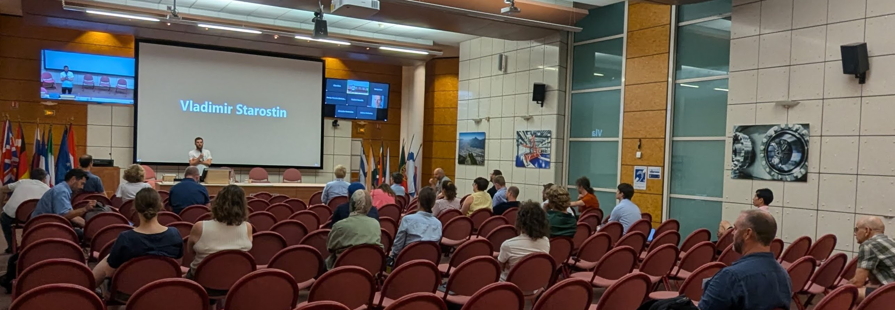
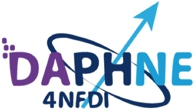

# the 6th Open Reflectometry Standards Organisation ORSO annual meeting

Took place on the 19th July at ILL/ESRF campus as a satellite to the [SXNS17 Conference](https://workshops.ill.fr/e/sxns17). 

The meeting was organised (including financial support) in association with: 

The mission of [DAPHNE4NFDI](https://www.daphne4nfdi.de/english/index.php) is to make data from photon and neutron experiments "FAIR", thereby making scientific work more efficient and gaining more knowledge from the data.

Unfortunately we were not able to record all of the sessions, but all available content from the meeting will be linked here:

## Session details

## Morning Parallel Breakout Sessions

### 09:00-10:20 Open Data in Reflectometry (Chaired by Bridget Murphy, Max Skoda): 

The Reflectometry community along users of all Photon and Neutron (PaN) facilities internationally are currently required by funding agencies to implement FAIR -Findable, Accessible, Interoperable and Reusable- data principles for experiments realized on the basis of public funding. The implementation of the FAIR principles constitutes a major challenge for both the PaN facilities and also the reflectometry user communities and needs to be solved in a common approach with a shared accountability. In Germany the user representatives of [KFS](https://www.sni-portal.de/en/user-committees/committee-research-with-synchrotron-radiation?set_language=en) (Komitee Forschung mit Synchrotronstrahlung) and [KFN](https://www.sni-portal.de/en/user-committees/committee-research-with-neutrons) (Komitee Forschung mit Neutronen) initiated the DAta from PHoton and Neutron Experiments - [DAPHNE4NFDI](https://www.daphne4nfdi.de/english/) - project in which users and facilities are collaborating to make data FAIR and is building upon the groundbreaking work of the [PaNOSC](https://www.panosc.eu/) and [ExPaNDS projects](https://expands.eu/). 

ORSO in collaboration with the DAPHNE4NFDI consortium are addressing the topics and implications of FAIR data and Open Data policy for the reflectometry community. The purpose of the first part of this meeting was to exchange the current status across the world to get as wide as possible an input and discuss the issues from differing national user communities’ perspectives. The session included:

* Presentations of the work done to date by DAPHNE, ORSO & ExPaNDS
* Slides:
  * [Bridget Murphy](https://github.com/reflectivity/reflectivity.github.io/blob/76a34d6ed5aaaa123c6ac72548769cba27080e75/workshops/workshop_2024/1_Daphne_4_ORSO_SXNS17_20240719.pdf),
  * [Julia Kobos](https://github.com/reflectivity/reflectivity.github.io/blob/76a34d6ed5aaaa123c6ac72548769cba27080e75/workshops/workshop_2024/2_2024_ORSO.pdf),
  * [Wout De Nolf](https://github.com/reflectivity/reflectivity.github.io/blob/76a34d6ed5aaaa123c6ac72548769cba27080e75/workshops/workshop_2024/3_2024_07_ORSO_WDN.pdf),
  * [Andy G&ouml;tz](https://github.com/reflectivity/reflectivity.github.io/blob/9e2bbcab92ad8b7e11ad442271dd000ad77f0a25/workshops/workshop_2024/PaNOSC_ExPaNDS_ORSO_2024.pdf)
* Discussion of overlap and collaboration opportunities
* Discussion on legal issues associated with personally identifiable info (e.g. GDPR/data protection/names).
* We also invite any interested particiants to submit an abstract for presentation
  
We hope that the output from this session will be a joint paper on Metadata and the setting up of a reflectometry data base for shared data.
You are welcome to fill-in the survey [here](https://docs.google.com/forms/d/e/1FAIpQLSdx4waVnd19mK2QW_qBlYsS1E8Z_PhjQ5pxQUTUSemUacikjQ/viewform).

### 09:00-10:20 SLD database (Chaired by Tom Arnold, Jochen Stahn)
The [ORSO SLD database](https://slddb.esss.dk/slddb/) is now live.

The first part of the session Artur Glavic presented the current status of the database followed by discussion and feedback

In the secod part of the session participants directly contributed data to the database. 

## 10:20 - 10:40 Coffee break 

### 10:40-12:00 Discussion on the orso model language(s) (Chaired by Brian Maranville)

An introduction to the model language was given by Brian Maranville [slides](https://github.com/reflectivity/reflectivity.github.io/blob/62c033fec209f6f12d056531012b11f739ec2fb9/workshops/workshop_2024/ORSO_AGM_2024_Analysis_Session_1_Model_Language.pdf)

The [model language](https://www.reflectometry.org/advanced_and_expert_level/file_format/simple_model) initiative within ORSO is an effort to create a standard way to specify a reflectometry model.  As a first step, we want to provide a syntax to define a layered structure with slabs of material with a known scattering strength (SLD) or Material. 

In addition we define a very compact syntax for providing a quick summary of the structure of layered samples, that can be added to searchable metadata attached to an ORSO datafile, e.g. "air  \| Ni 100  \| SiO2 0.5  \| Si".  

A benefit of the standard (serializable) model language is that we can then share effort among the entire community on building model-builders, for general layer-based models and then in the future for more specialized representations of reflectivity samples.  It is expected that specialized domains like membrane reflectometry will have their own specialized model languages (that can be rendered into a layered version), as well as custom model builders.

Discussion topics for the session included:
 * the relationship of this compact language to the full model language
 * the draft model language that is implemented in the orsopy package: the current capabilities and what we might want to add or change.  
 * what are the barriers to broad adoption of the model language by common analysis packages
 * first steps on cooperative work on a model-builder targeting the shared language
 * any comments on how to get started with domain-specific sub-languages (and domain-specific model builders)

### 10:40-12:00 Teaching materials "code camp" (chaired by Andrew McCluskey)

Building on the success of the previous session to improve the online [Guide to Reflectometry](https://www.reflectometry.org/learn/intro.html) this was another "hackathon" style session to improve this material. The session was able to add material and identify some areas for further work.

## Afternoon Parallel Breakout Sessions 12:00-14:45

### 12:00 - 14:45 Reproducibility working group (Chaired by Bridget Murphy, Max Skoda)

Several tasks within ORSO present opportunities for application of machine learning techniques, such as experimental design, script generation, and fitting procedures. Machine learning often relies on training with existing data, and the process of curating appropriate training datasets is frequently the most challenging and time-intensive aspect of model development. Notably, the collective expertise of x-ray and neutron reflectivity users encompasses a wealth of (labeled) datasets, including data, fitting models, and experiment scripts. Consolidating these resources into a unified database could yield significant synergistic advantages. Such a repository would facilitate easy access to labeled data for individuals seeking training datasets and for those validating their own models and scripts. In this session, the aim was to explore the potential benefits of such a database and to discern the necessary steps for its establishment.

* [Talk by Jos Cooper (ESS): Optimizing experiments and creating unlimited realistic data for AI using HOGBEN](https://zenodo.org/records/13219541) [video](https://youtu.be/3uAiXOvv75U)
* A discussion on the potential for reference datasets for machine learning and other uses

### 12:00 - 14:45 Recent Developments in Reflectometry Analysis (Chaired by Andrew Nelson)

This session discussed recent developments to the state of the art reflectometry packages available to the scientific community. 

Following these presentations there was a discussion on the advances/functionality the community would like to see being worked on in data analysis.

#### Speakers
* refnx - Andrew Nelson [slides](https://github.com/reflectivity/reflectivity.github.io/blob/6b05e75fb1f8771ed67524d9cd92eb2bfa0dd000/workshops/workshop_2024/6_ORSO_refnx_update.pdf) [video](https://youtu.be/8DTnEsvKjtQ) 
* genx - Artur Glavic (no slides or video available)
* refl1d - Brian Maranville [slides](https://github.com/reflectivity/reflectivity.github.io/blob/6b05e75fb1f8771ed67524d9cd92eb2bfa0dd000/workshops/workshop_2024/3_SXNS_2024_Refl1D_Update.pdf)
* RasCal - Arwel Hughes [video](https://youtu.be/xB84BrljJL0) 
* mlreflect - Vlad Starostin [video](https://youtu.be/3fTHDpqmPAQ) 
* anaklasis - Alexandros Koutsioumpas [video](https://youtu.be/sJoP0ZYojPg) 
* BornAgain - Joachim Wuttke [slides](https://github.com/reflectivity/reflectivity.github.io/blob/6b05e75fb1f8771ed67524d9cd92eb2bfa0dd000/workshops/workshop_2024/talkWuttke.pdf)
* easyReflectivity - Andrew McCluskey (no slides or video available)

## Afternoon Plenary session 15:00-17:00

### Keynote science talk(s) 15:00-15:45

Speaker(s):

**Mathieu Doucet (Neutron Scattering Division, ORNL): "Time-resolved neutron reflectometry study of lithium-mediated nitrogen reduction"**

[slides](https://github.com/reflectivity/reflectivity.github.io/blob/16bd35b760902dc53dabea194fd28f5a78cecd45/workshops/workshop_2024/t_NR_ORSO_doucet.pdf)

[video](https://youtu.be/5L3HmYhC0IY)

Abstract: Li-mediated electrochemical reduction of nitrogen to NH3 has been identified as an alternative to the resource-demanding Haber-Bosch ammonia process. Through this process, an initial electrodeposition of Li is followed by a reaction to form Li3N and subsequent ethanolysis of Li3N to form NH3. We studied Li electrodeposition on molybdenum and copper thin films and compared LiClO4 and LiBF4-based THF electrolytes. 
We used time-resolved neutron reflectometry to understand the SEI formation during the nitrogen reduction process. 
The neutron reflectometry data acquired during plating was sliced in 15- to 60-second intervals in a wide enough Q range to allow time-resolved modeling of the plating and SEI formation processes. We will present our approach to time-resolved reflectometry and discuss the recent developments and challenges of analyzing transient data.

**Stefan Kowarik (University of Graz): "Quick XRR down to 300 µs and fast, accurate AI analysis”**

[slides](https://github.com/reflectivity/reflectivity.github.io/blob/f0b1c9d7642ab5ae65edbb102c62ee5ebafc0f4a/workshops/workshop_2024/ORSO_Kowarik_01.pdf)

[video](https://youtu.be/2JHVEG4Lu1E) 

Abstract: We show that we can accurately measure XRR curves in (sub)-millisecond timeframes using fast scanning galvo mirrors / rotating samples, and going to the limits of detectors and photon flux at synchrotrons. Leveraging the speed of quick XRR, this method permits the real-time monitoring of rapid thin film deposition processes such as spin coating. The resultant high volume of XRR data, often reaching tens of thousands of curves, benefits from the integration of a rapid machine learning algorithms. These AI / machine learning algorithms not only expedite the analysis but also surpass traditional differential evolution methods with fewer outliers. Additionally, AI-controlled adaptive in XRR measurements can contribute to a fourfold reduction in the number of measurement points required for comparable results.  These methods together pave the way for XRR to study ever faster processes in fields such as electrochemistry or thin film growth.
  
## 14:45 - 15:00 Coffee break 

### Annual General Meeting

**15:45 – 16.05: Short Reports from each of the Working groups.**

* Tom Arnold, Bridget Murphy: Education & Outreach Working Group (inc. review of the [ORSO Governing Principles](https://www.reflectometry.org/organisation_and_communication/orso_governing_principles/).)
* Andrew McCluskey: Reproducibility Working Group 
* Max Skoda, Jochen Stahn: Data Formats Working Group 
* Brian Maranville, Andrew Nelson: [Data Analysis Working Group Presentation](https://github.com/reflectivity/reflectivity.github.io/blob/master/workshops/workshop_2024/ORSO-analysis-update.pdf)
  
**16:05 - 16:40 How to get involved and contribute to ORSO**
We would like to have a discussion on how to encourage contributions to ORSO. This will involve a short explaination on how we currently work with demonstrations aimed at different levels including: 
* A survey of how people would be able to contribute. Please complete this [survey](https://reflectometry.us10.list-manage.com/track/click?u=e7e953117fa45f665f9030aaa&id=25f4a162c3&e=36bf5c9247) in advance of the meeting! 
* Introduction to GitHub
* How to edit the website and contribute material

**16:40 - 17:00: Voting**

Elections were held and the following people were elected for a 4-year term as ORSO Co-chair:
* Education and Outreach: Stefan Kowarik (Bridget Murphy has stood down)
* Reproducibility: Maciej Jankowski
* File Formats: Jos Cooper and Max Skoda (Jochen Stahn has stood down)
* Data Analysis: Andrew Nelson

In addition it was proposed to create a new working group on Sample Environment. The first chairs of this working group were nominated as:
* Sophie Ayscough 
* Ben Humphreys 

They will now work to define the scope of this working group

### Close

